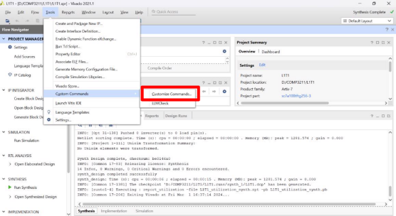
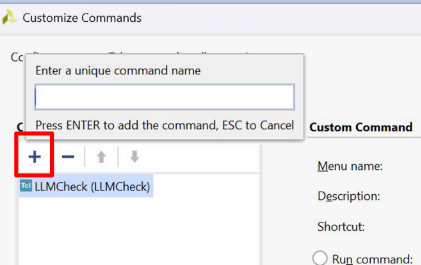
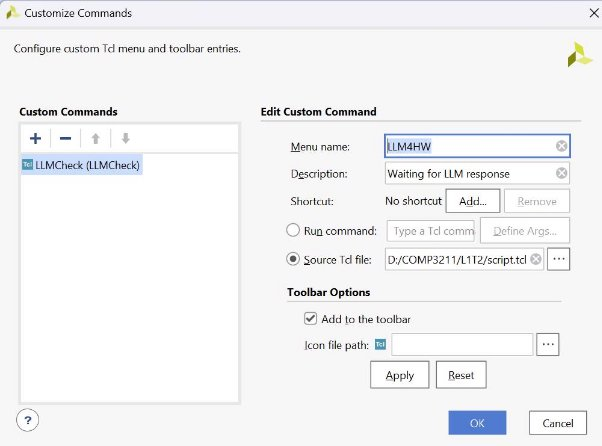
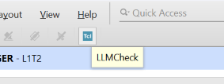
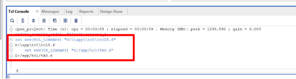
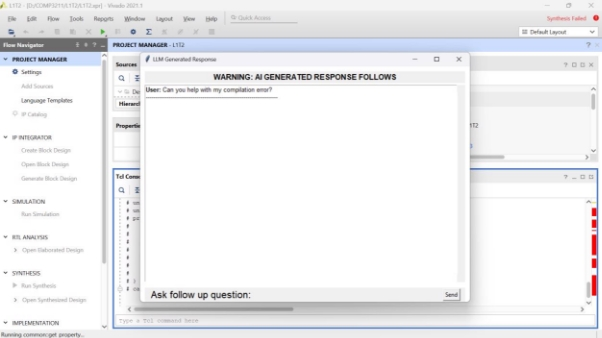
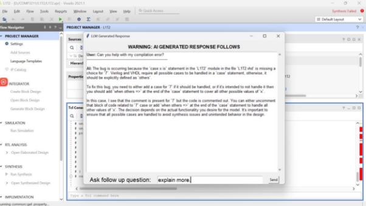
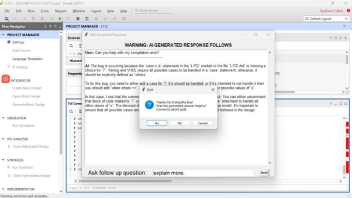

## LLM Tools on Vivado Setup Guide 

### Siyu Qiu 

### Contents 

[Overall .................................................................................................................... 2 ](#_page1_x69.00_y72.92)
[Install and setup environment ................................................................................... 2 ](#_page1_x69.00_y214.92)
[Hardware Project Setup............................................................................................ 2 ](#_page1_x69.00_y323.92)

[Create a Project in Vivado: .................................................................................... 2 ](#_page1_x69.00_y365.92)

[Add a Custom Button: ........................................................................................... 2 ](#_page1_x69.00_y422.92)
[Configure the Tcl Script: ........................................................................................... 4 ](#_page3_x69.00_y191.92)
[Usage...................................................................................................................... 6 ](#_page4_x69.00_y593.92)

### Overall 

This guide provides a step-by-step approach to setting up and using a custom Large Language Model (LLM) integration within Xilinx Vivado. By following these instructions, users will be able to create a new project in Vivado, add custom commands, and 

configure Tcl scripts to facilitate seamless interactions with LLM tools. This setup aims 

to enhance the hardware design process by leveraging LLM capabilities to provide 

instant responses and solutions directly within the Vivado environment.

### Install and setup environment 

Follow the instructions provided at [LLM4HW to ](https://pypi.org/project/LLM4HW/)install the necessary packages and system dependencies.

You can download using pip install LLM4HW

### Hardware Project Setup  

#### Create a Project in Vivado: 

- Open Vivado and create a new project.

#### Add a Custom Button: 

- Navigate to Tools > Custom Commands > Customize Commands…
- Create your own Tcl button by clicking on the “+” to add a new Custom Command. 

  

- Enter a unique command name, e.g., LLM4HW, and press Enter.

  

- Set up the custom command
- **Menu Name:** Give a distinctive name to the button (e.g., LLM4HW). 
- **Description:** Enter "Waiting LLM response." 
- **Source Tcl File:** Browse and select the direction of your script.tcl file. 
- Click on “Add to the Toolbar” and then click Apply. 
- Click OK. 

Now, you should see a new button on the top toolbar in Vivado.

### Configure the Tcl Script: 

1. Determine the Tcl and Tk versions used by Python's Tkinter:
- Open your command prompt and type the following:

python -c "import tkinter as tk; import os; root = tk.Tk(); tcl\_lib = root.tk.eval('info library'); tk\_lib = root.tk.eval('info library'); print('Tcl version:', root.tk.call('info', 'patchlevel')); print('Tk version:', root.tk.call('info', 'patchlevel')); print('Tcl library location:', tcl\_lib); print('Tk library location:', tk\_lib); root.destroy()"

2. Find the location of the Python executable:
   - Use the command: where python
3. Open script.tcl and modify the commands according to the output of the previous steps. 

unset -nocomplain ::env(PYTHONHOME)

unset -nocomplain ::env(PYTHONPATH)

#! /usr/bin/tclsh

proc call\_python {} {

set env(TCL\_LIBRARY) <tcl library location> 

set env(TK\_LIBRARY) <tk library loaction> 

set python\_script\_path <the location path you download for client.py> set python\_exe <location of the python.exe on your system>

set project\_path [get\_property DIRECTORY [current\_project]]

set output [exec $python\_exe $python\_script\_path $project\_path]

puts $output

} 

call\_python

For example, if you follow this step-by-step guide, you will expect the commands to look like the following: 

unset -nocomplain ::env(PYTHONHOME)

unset -nocomplain ::env(PYTHONPATH)

#! /usr/bin/tclsh

proc call\_python {} {

set env(TCL\_LIBRARY) "D:\\app\\tcl\\tcl8.6"

set env(TK\_LIBRARY) "D:\\app\\tcl\\tk8.6"

set python\_script\_path "D:\\chip chat\\llm-hw-help-annie\\new.py" set python\_exe "D:\\app\\python.exe"

set project\_path [get\_property DIRECTORY [current\_project]]

set output [exec $python\_exe $python\_script\_path $project\_path] puts $output

} 

call\_python

4. Before you use it, type the two commands (in script.tcl file) to TCL console first 

set env(TCL\_LIBRARY) <tcl library location> set env(TK\_LIBRARY) <tk library loaction>

5. Now, the plugin tool is ready to be used in Vivado! 

Usage 

**Operation:** 

- Press the newly added button to open a new window. A default question is preset, and you can await the response.

- If you have more questions, type them into the “Ask Follow Up Question” box.

**Completion:** 

- Once you have received your response and know how to proceed, press the exit button to close the tool. 
- We appreciate your feedback on the responses! 
- **Please share your thoughts so we can continue to improve.**

  
